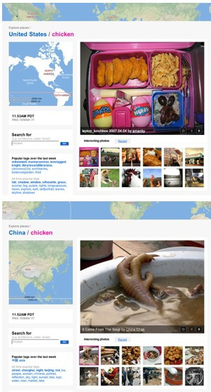

# whosonfirst-categories

IMPORTANT: THIS IS WORK IN PROGRESS.

Right now it is as much about just putting things down on paper to look at them
as it is actually deciding the how or the what of anything.

## It's like triples... but with a point of view

### Points of view

At the moment there is only one point of view. The point (sorry) is there can be
others but there aren't yet. You know, [like this](https://boingboing.net/2007/11/09/flickr-places-shows.html):



The default point of view, to start with, is essentially the tyranny of the
commons. It is "stuff people search for" and other things can be easily ranked
and quantified in to something you might understand as popular or dominant
opinion.

Example points-of-view might include:

* consensus
* local
* tourist

### Classes

The view from 50, 000 feet, approximately. These are high level buckets of human
activities. The convention and best practice for classes is that there are
roughly only (10) of them per point of view.

Classes are parented by points of view. Example classes might include:

* eating
* drinking
* industry
* natural

### Categories

_This is an unfortunate name. We should find another one._

The view from 10, 000 feet approximately. This is like when someone asks you how
your day was and you're _not_ the boring person who answers the question in
detail.

This is more like saying _that_ you threw your laptop across the room rather
than _why_.

The convention and best practice for categories is that are roughly 10x of them
relative to their parent class.

Categories are parented by classes. Example categories might include:

* restaurant
* department-store
* veterinarian

### Sub-categories

_This is an even more unfortunate name than "category". We should find another one
for this, too._

This is a free-for-all. Essentially these are just tags with a parent
(sub-category) and a grandparent (category) and some serious sins-of-the-father
baggage (point of view).

There can be an arbitrary number of sub-categories for class/category pair.

Sub-categories are parented by categories. Example sub-categories might include:

* afghan
* chinese
* bagels

## Tags

You know, words. Or short sequences of words. Not paragraphs. When in doubt, not
this:

https://collection.cooperhewitt.org/media/page414

Tags are parented by sub-categories (and maybe categories). Example tags are left as an exercise to the reader.

## Naming conventions

Naming conventions for keys/properties in any JSON representation of a type
(class, category, etc.)

### id

Brooklyn Integers, yo.

### name

This is a URL-safe name that is unique across its type (class, category, etc.)
and ideally unique across all types. Names may **not** contain colons (`:`) for
reasons that are explained below.

### label 

A human-readable display label. (Something something something translations and
localizations...)

### class

This property would be defined in the definition for a category and be a list of
well-defined structured strings denoting the point of view and class (that the
category belongs to). For example:

```
"name": "restaurant",
"class": [ "consensus:eating", "tourist:eating", "local:nomnomnom" ],
```

Strings should be parsed left-to-right, splitting on colons. The position and
order of each part of the string corresponds to a specific type:

```
POINT-OF-VIEW > CLASS 
```

Each part of the exploded string points to the URL-safe name (and by extension
filename) for that type so that you can easily refer to
`points-of-view/POINT-OF-VIEW.json` and so on.

### category

This property would be defined in the definition for a sub-category and be a list of
well-defined structured strings denoting the point of view, class and category (that the
sub-category belongs to). For example:

```
"name": "afghan",
"category": [ "consensus:eating:restaurant", "local:nomnomnom:restaurant" ],
```

Strings should be parsed left-to-right, splitting on colons. The position and
order of each part of the string corresponds to a specific type:

```
POINT-OF-VIEW > CLASS > CATEGORY
```

Each part of the exploded string points to the URL-safe name (and by extension
filename) for that type so that you can easily refer to
`categories/CATEGORY.json` and so on.

## Translations and localization

See also: [How we handle place names in Who's On First](https://mapzen.com/blog/who-s-on-first#names)

## Gotchas

### Homonyms

Sigh...

### Counts (for things like sub-categories)

Or more specifically the absence of any sub-categories for `class:category` pair. Yeah, that's a thing...
